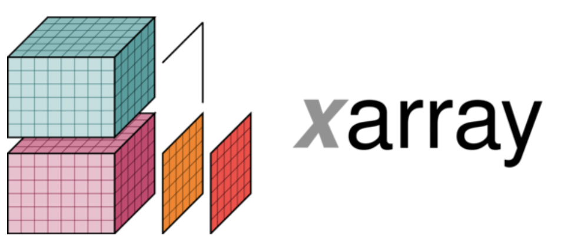
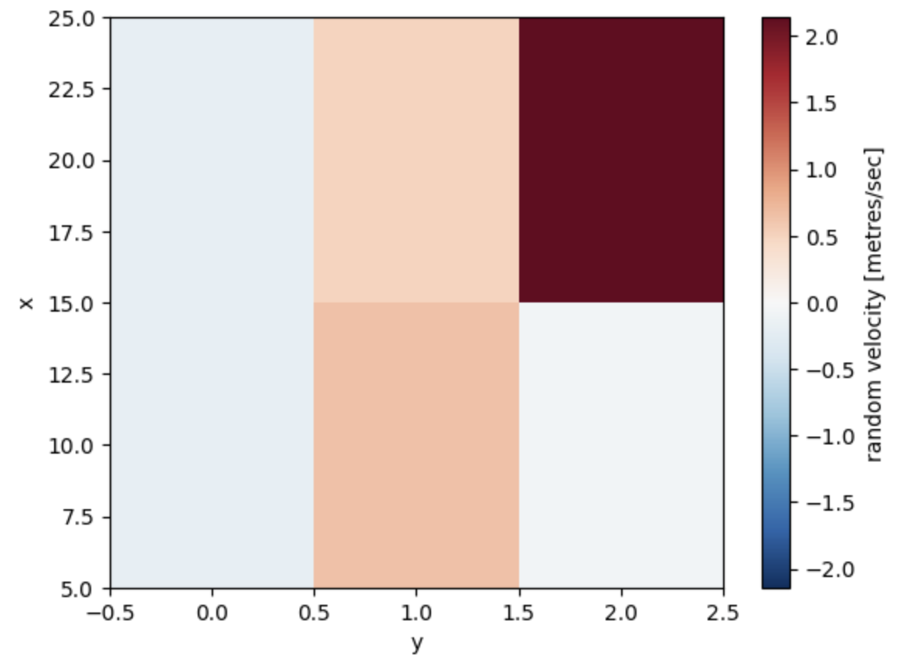

# Xarray with Dask
This tutorial demonstrates how we can use Xarrays with Dask.

Learning outcomes of the tutorial are:
1. Learn the basics of Xarray.
2. Learn how to use Xarrays with Dask.
3. Learn how to scale Xarray on Dask

Prerequisite:
1. Experience with Dask High-level objects 

***



Xarray extends the labeled data functionality of Pandas to N-dimensional array-like datasets. It shares a similar API to NumPy and Pandas and supports both Dask and NumPy arrays under the hood. In Xarray a labeled, N-dimensional array is called <span style="color:deepskyblue"> **DataArray**</span>. <span style="color:deepskyblue"> **Dimensions**</span>  provide names that xarray uses instead of the axis argument found in many numpy functions.  <span style="color:deepskyblue"> **Coordinates**</span> enable fast label based indexing and alignment. This is similar to functionality of the index found on a pandas DataFrame.

```

data = xr.DataArray(np.random.randn(2, 3), dims=("x", "y"), coords={"x": [10, 20]})

```
Here **x** and **y** are the dimensions and **10** and **20** are the coordinates.

***

## Indexing in Xarray
There are multiple methods to indexing in Xarray
1. Positional and by integer label, like numpy
```
data[0, :]
```
2. loc or "location": positional and coordinate label, like pandas
```
data.loc[10]
```
3. isel or "integer select": by dimension name and integer label
```
data.isel(x=0)
```
4. sel or "select": by dimension name and coordinate label
```
data.sel(x=10)
```
Label-based indexing is particularly usesful as we dont need to know how our array is organized. All we need to know are the dimension name and the label we wish to index. **data.sel(x=10)**, works regardless of whether x is the first or second dimension of the array and regardless of whether 10 is the first or the second element of x.

***
### Similarity to Numpy and Pandas
Xarray works similar to Numpy arrays with the additional option of using labels. 
```
mean = data.mean(dim="x")
```
Another advantage of Xarray is that arithmetic operations broadcast is possible for DataArray of different dimension. 
```
a = xr.DataArray(np.random.randn(3), [data.coords["y"]])
b = xr.DataArray(np.random.randn(4), dims="z")
c = a + b
```
Xarray also supports groupby operations similar to the pandas API.
```
labels = xr.DataArray(["E", "F", "E"], [data.coords["y"]], name="labels")
data.groupby(labels).mean("y")
```
***

## Attributes in Xarray
In Xarray metadata can be represented using attributes. **attrs** is just a Python dictionary, so you can assign anything you wish.

```
data.attrs["long_name"] = "random velocity"
data.attrs["units"] = "metres/sec"
data.attrs["description"] = "A random variable created as an example."
data.attrs["random_attribute"] = 123
```
This metada can then be used in plottinf data in the Xarray object.



***

## Pandas and Xarray
Xarray objects can be easily converted to and from pandas objects using the to_series(), to_dataframe() and to_xarray() methods

```
df =  data_conv.to_dataframe(name="Values")
```

## Dataset
**xarray.Dataset** is a dict-like container of aligned DataArray objects. You can think of it as a multi-dimensional generalization of the pandas.DataFrame.
```
ds = xr.Dataset(dict(foo=data, bar=("x", [1, 2]), baz=np.pi))
```
This creates a dataset with three DataArrays named foo, bar and baz. We can use dictionary or dot indexing to pull out Dataset variables as DataArray objects. Assignment only works with dictionary indexing.

When creating ds, foo is two-dimensional two dimensions x and y, bar is one-dimensional with single dimension x and and baz is a scalar not associated with any dimension in ds.Variables in datasets can have different dtype and even different dimensions, but all dimensions are assumed to refer to points in the same shared coordinate system i.e. if two variables have dimension x, that dimension must be identical in both variables.

For example, when creating ds xarray automatically aligns bar with DataArray foo, i.e., they share the same coordinate system so that **ds.bar['x'] == ds.foo['x'] == ds['x']**. As the coordinates are alligned we can index ds.bar.sel(x=10), even when this dimensuin has not been defined for bar

***

## netCFD
The recommended way to store xarray data structures is netCDF, which is a binary file format for self-described datasets. It is mainly used in geosciences. Xarray is based on the netCDF data model, so group of netCDF files on disk directly correspond to Dataset objects in Xarray.
```
ds = xr.Dataset(
    {"foo": (("x", "y"), np.random.rand(4, 5))},
    coords={
        "x": [10, 20, 30, 40],
        "y": pd.date_range("2000-01-01", periods=5),
        "z": ("x", list("abcd")),
    },
)
```

Similarly we can also open an existing netCFD file.
```
ds_nc = xr.open_dataset("saved_on_disk.nc")
```
***
## References
1. [https://tutorial.dask.org/00_overview.html](https://examples.dask.org/xarray.html)

*** 
## Contributers
1. [Joseph John](https://www.josephjohn.org), Staff Scientist - Training, National Computational Infrastructure (NCI).


